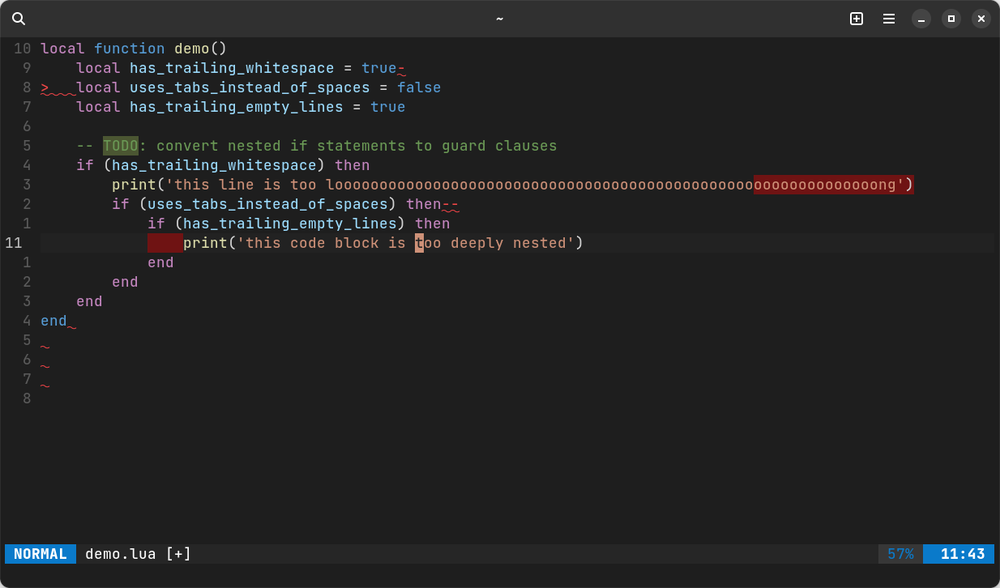

# nvim-strict

Strictly enforce configurable, best-practice code style with this [Neovim](https://neovim.io/) plugin. Expose deep nesting, overlong lines, trailing whitespace, trailing empty lines and inconsistent indentation.



Strict (or nvim-strict) is an all-Lua wrapper for a collection of regular expressions which combine to provide lightweight, IDE-like code style hints and formatting. Strict is not a code formatting plugin; it formats everything around code.

## Features

* Highlights deeply-nested code
* Highlights overlong lines
* Highlights and removes trailing whitespace
* Highlights and removes trailing empty lines
* Highlights and converts tab / space indentation
* Formatting functions preserve window, cursor, jumplist and search state
* Include and exclude filetypes
* Mappable functions
* Highly configurable
* Blazingly fast

## Installation

Strict can be installed using any package manager. Here is an example using [packer.nvim](https://github.com/wbthomason/packer.nvim) to install and setup Strict using the default configuration. Note that Strict is only enabled once the `setup` function has been called.

```lua
use({
    'emileferreira/nvim-strict',
    config = function()
        require('strict').setup()
    end
})
```

## Configuration

Strict comes with batteries included and (IMHO) sane defaults. The default configuration is shown below. It can be modified and passed to the `setup` function to override the default values.

```lua
local default_config = {
    included_filetypes = nil,
    excluded_filetypes = nil,
    excluded_buftypes = { 'help', 'nofile', 'terminal', 'prompt' },
    match_priority = -1,
    deep_nesting = {
        highlight = true,
        highlight_group = 'DiffDelete',
        depth_limit = 3,
        ignored_characters = nil
    },
    overlong_lines = {
        highlight = true,
        highlight_group = 'DiffDelete',
        length_limit = 80
    },
    trailing_whitespace = {
        highlight = true,
        highlight_group = 'SpellBad',
        remove_on_save = true,
    },
    trailing_empty_lines = {
        highlight = true,
        highlight_group = 'SpellBad',
        remove_on_save = true,
    },
    space_indentation = {
        highlight = false,
        highlight_group = 'SpellBad',
        convert_on_save = false
    },
    tab_indentation = {
        highlight = true,
        highlight_group = 'SpellBad',
        convert_on_save = true
    }
}
```

The following is an example of a more forgiving configuration.

```lua
require('strict').setup({
    excluded_filetypes = { 'text', 'markdown', 'html' },
    deep_nesting = {
        depth_limit = 5,
        ignored_characters = '\'".'
    },
    overlong_lines = {
        length_limit = 120
    }
})
```

## Keymaps

The formatting functions are exported for use in keymaps, autocmds or other plugins. Below is a basic example of using the functions in keymaps.

```lua
local strict = require('strict')
local options = { noremap = true, silent = true }
vim.keymap.set('n', '<Leader>tw', strict.remove_trailing_whitespace, options)
vim.keymap.set('n', '<Leader>tl', strict.remove_trailing_empty_lines, options)
vim.keymap.set('n', '<Leader>st', strict.convert_spaces_to_tabs, options)
vim.keymap.set('n', '<Leader>ts', strict.convert_tabs_to_spaces, options)
```

## Contributing

Pull requests, bug reports and feature requests are welcomed.
